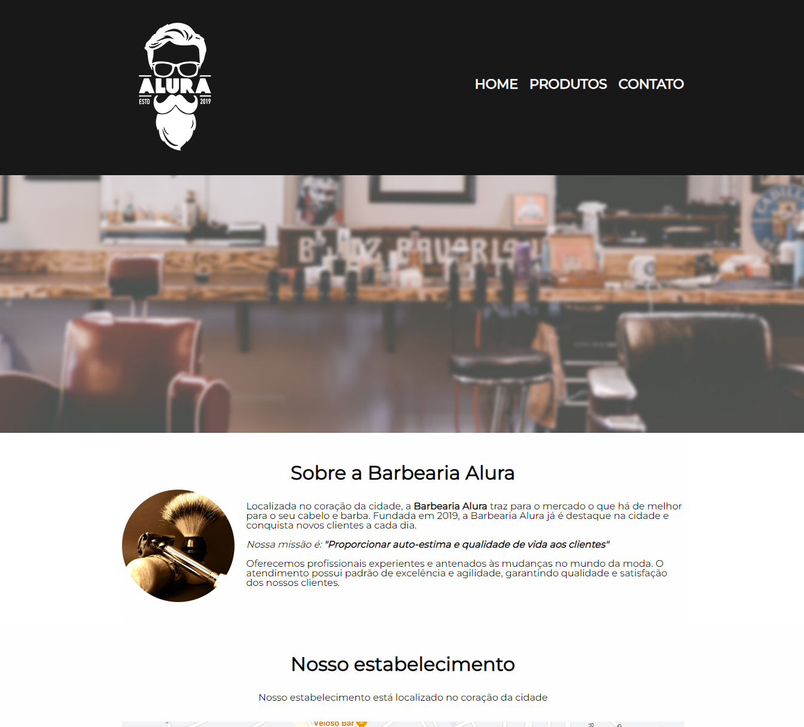

<h1 align="center"> Barbearia Alura </h1>
 

  
  

> Status do Projeto: :heavy_check_mark: 

### Tópicos 

:small_blue_diamond: [Descrição do projeto](#descrição-do-projeto)

:small_blue_diamond: [Layout e Deploy da Aplicação](#layout-e-deploy-da-aplicação)

:small_blue_diamond: [Pré-requisitos](#pré-requisitos)

## Descrição do projeto 

  Página web simples construída apenas com HTML e CSS, tendo como objetivo principal aplicar os conceitos vistos nos módulos iniciais do programa Desenvolve 2023 do Grupo Boticário.  

## Layout e Deploy da Aplicação

> Link do deploy da aplicação: 

## Pré-requisitos

Não existe nenhum pré-requisito para executar esse projeto. Basta clonar o repositório na sua máquina.

## Autor

[ Daniel Andrade](https://github.com/andrsx) 

- Linkedin - [@Daniel Andrade](https://www.linkedin.com/in/daniel-andrade-08b82125a/)

## Licença 

The [MIT License]() (MIT)

Copyright :copyright: 2023 - Barbearia Alura
